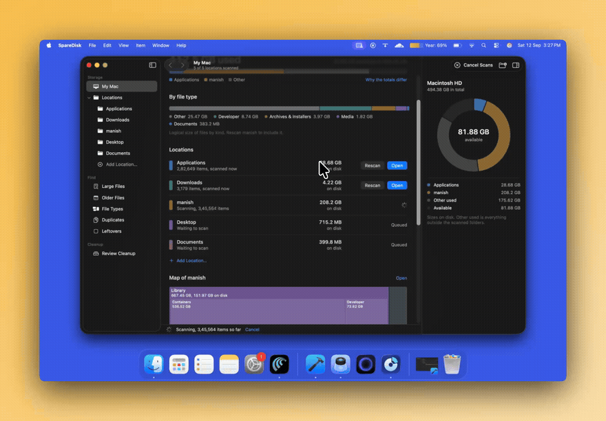

# SpareDisk

> See where your space goes. A native macOS storage analyzer with Trash-only cleanup.

SpareDisk is a sandboxed, SwiftUI-native macOS utility that analyzes folders **you explicitly grant access to**, shows where disk space goes, helps you find large / old / duplicate / leftover files, and moves items to the Trash **only after you review and confirm**. No permanent delete, no cloud upload, no Full Disk Access.

- **Bundle ID:** `com.minilabs.SpareDisk`
- **Category:** `public.app-category.utilities`
- **Stack:** Swift 5.0, SwiftUI, AppKit, CryptoKit, QuickLookUI, Charts, UniformTypeIdentifiers
- **Requirements:** macOS 15.0+, Xcode 26.6+, Apple Silicon (arm64, x86_64 excluded)
- **Dependencies:** none (no SPM, CocoaPods, or network libraries)
- **Website:** https://sparedisk.minilabs.cc/ · **Privacy:** https://sparedisk.minilabs.cc/privacy.html · **Support:** support@minilabs.cc

## Demo

[](https://github.com/0xdevrel/sparedisk/blob/main/docs/sd.mp4)

<video src="https://raw.githubusercontent.com/0xdevrel/sparedisk/main/docs/sd.mp4" poster="docs/sd-poster.jpg" width="100%" controls autoplay muted loop playsinline preload="metadata">
  Your browser does not support the video tag. Watch it <a href="https://github.com/0xdevrel/sparedisk/blob/main/docs/sd.mp4">here</a>.
</video>

> ~1:42 screen recording (`docs/sd.mp4`, 1552×1080, H.264): My Mac overview with used-space total, per-type bar, location rows and volume donut → live scan with item-count progress → Large Files browsing → sunburst map drill-down into a location.

---

## Table of Contents

- [Demo](#demo)
- [What it does](#what-it-does)
- [Design principles](#design-principles)
- [Features](#features)
- [How it works](#how-it-works)
- [Safety model](#safety-model)
- [Privacy and permissions](#privacy-and-permissions)
- [Requirements](#requirements)
- [Build, run, test](#build-run-test)
- [Usage guide](#usage-guide)
- [Keyboard shortcuts](#keyboard-shortcuts)
- [Project structure](#project-structure)
- [Architecture](#architecture)
- [Data model](#data-model)
- [Views and navigation](#views-and-navigation)
- [Scan details](#scan-details)
- [Duplicates, leftovers, related data](#duplicates-leftovers-related-data)
- [Maps: treemap and sunburst](#maps-treemap-and-sunburst)
- [Testing](#testing)
- [Debug launch flags](#debug-launch-flags)
- [Limitations and honest scope](#limitations-and-honest-scope)
- [Roadmap](#roadmap)
- [Brand assets](#brand-assets)
- [Docs](#docs)
- [License](#license)

---

## What it does

1. You add one or more **Locations** (e.g. Home folder, `/Applications`, an external drive) via the system folder picker.
2. SpareDisk performs a **metadata-only parallel scan** of each location (one `lstat` per item, no file-content reads except for duplicate hashing, no symlink following, no iCloud hydration).
3. You explore results in **My Mac overview**, **Browse**, **Large Files**, **Older Files**, **File Types**, **Duplicates**, and **Leftovers** — as a sortable list, squarified treemap, or two-ring sunburst.
4. You stage candidates in a **Review Cleanup** queue, confirm once, and SpareDisk revalidates every item immediately before calling `FileManager.trashItem`. Anything changed, out-of-scope, managed, or system-owned is refused with a reason.
5. Space is reclaimed when **you empty the Trash in Finder**. SpareDisk never deletes permanently.

---

## Design principles

| Principle | How it is enforced in code |
|---|---|
| **User-granted access only** | `LocationAccessService` stores `.withSecurityScope` bookmarks in `UserDefaults` (`SpareDisk.LocationBookmarks.v1`). No Full Disk Access, no ambient filesystem access. |
| **Metadata-only by default** | `ScanEngine` uses a single `Darwin.lstat` per path for type/size/allocation/mtime/link-count/inode/device/dataless flag. No `FileManager.enumerator` resource keys, no content reads during scan. |
| **Trash-only mutation** | Only `CleanupService.trashOne` mutates files, via `FileManager.trashItem`. No permanent-delete fallback, no retry, batch is cancellable between items and non-atomic. |
| **Fail-closed revalidation** | `CleanupService.revalidate` rejects anything it cannot positively confirm (identity, scope containment, type, size/date, cloud state, managed descendants). |
| **Local-only** | No network code, no accounts, no telemetry. `PrivacyInfo.xcprivacy` declares `NSPrivacyTracking=false`, no collected data. Last two scans per location live in `~/Library/Application Support/SpareDisk/Scans/`. |
| **Main-thread UI** | Target sets `SWIFT_DEFAULT_ACTOR_ISOLATION=MainActor`. `ScanEngine`, `CleanupService`, `DuplicateService` are explicitly `nonisolated` and run on detached workers; progress arrives via throttled `AsyncStream`. |

---

## Features

### My Mac (Overview) — `Views/OverviewView.swift`

- Volume capacity bar with legend (`SegmentedCapacityBar` + `FlowLayout`), “Why totals differ” popover, overshoot/elsewhere handling.
- Category totals bar (Documents / Media / Archives & Installers / Developer / Applications / System & Library / Other).
- Location rows with color bar, relative scan date, unreadable-folder count, scan-to-scan delta, Scan / Rescan / Open / Queued / Reconnect actions.
- Embedded treemap preview (300pt), top-8 largest files with inspector + context menu.
- First-launch cards: **Home / Applications / Other** (`MockData` seeds UI only; real unscanned locations never show sample contents).

### Browse — `Views/BrowseView.swift`

- Per-location drill-down (`FolderRows` up to 8 levels, `FileRow`, `FileListView` with sortable Name / Size / Modified header).
- Flat name search vs hierarchical list; unreadable badge; scan-changes sheet (`ScanDiff`); map color (`folder/type/age`) and size basis (`logical/onDisk`) pickers.
- Native file icons via `NSWorkspace.icon(for:)` (`FileTypeIcon.swift`) without opening contents; iCloud placeholder and review-queued badges.

### Find: Large / Older / Types — `Views/FindViews.swift`

- **Large Files:** threshold picker (100M / 500M / 1G / 5G, `@AppStorage`), top-200 per location.
- **Older Files:** month picker (6 / 12 / 24 / 60), by-year age chart + “Before” bucket, click-to-filter.
- **File Types:** All + per-category chips, totals bar, top-200 filtered.
- All three switch between list / map / sunburst and share `NodeContextMenu`.

### Duplicates — `Views/DuplicatesView.swift`, `Services/DuplicateService.swift`

- Finds byte-identical files among each scan’s largest files. Three-stage verify: size → 64KB head/mid/tail sample hash → full streaming SHA-256 → `memcmp` byte compare.
- Hard-link collapse by `volume:inode`, ≥1 MB minimum, cloud placeholders skipped with reasons, `IOPOL_THROTTLE` I/O politeness.
- Per-group keeper (default: newest `modified`), “Keep This Copy” menu, “Stage Rest” (never stages the keeper), redundant-bytes accounting. Clone disclaimer: APFS clones may free less than logical size.

### Leftovers — `Views/LeftoversView.swift`, `Services/LeftoverService.swift`

- Heuristic orphan detection under `~/Library`: `Containers`, `Group Containers`, `Application Support`, `Caches`, `HTTPStorages`, `WebKit`, `Preferences/*.plist`, `Saved Application State`, `Logs`, `Application Scripts`, `Cookies`.
- Bundle-ID parsing (strips `group.` prefix, 10-char team IDs, validates TLD/labels), `com.apple.*` treated as system, installed check via `NSWorkspace.urlForApplication` + running apps, CLI-ownership warning.
- Grouped list with display name, bundle ID, count, bytes, kind/path/date, per-group “Move to Trash”, “Move All to Trash”.

### Related data for apps — `Services/RelatedDataService.swift`

- For a selected `.app`: reads `Contents/Info.plist` `CFBundleIdentifier`, then checks 10 ID-derived paths + `Group Containers/*.<id>` + `CFBundleName/DisplayName/Executable` and vendor/product name matches under `Application Support/Caches`.
- Splits into **strong** (bundle identifier / shares identifier) vs **weak** (name-only) evidence (`UninstallPlan.split`). `UninstallSheet` pre-checks strong, unchecks weak. Nothing uninstalls apps or stops helpers — items flow through Review → Trash.

### Review Cleanup — `Views/ReviewViews.swift`, `Services/CleanupService.swift`

- Normalized queue (`CleanupService.normalize`: dedup by standardized path, drop descendants of queued folders). Header, confirmation sheet, running progress, per-item results.
- “Needs attention” vs “Queued” sections with risk labels, drag-and-drop URLs (`stage(urls:)`), `protectKeepers` / `requireKeepers` integration with Duplicates.
- After run: summary strip with “Show Trash / Dismiss”, queue pruned via `remaining(afterMoving:)`, leftover groups pruned.

### Inspector, Quick Look, Finder — `Views/InspectorView.swift`, `Services/ScopedActions.swift`, `Services/QuickLookBridge.swift`

- Single selection: identity, logical + allocated size, facts, top-10 children, related-data actions, Review / Trash / Quick Look / Reveal / Uninstall.
- Multi-selection totals + bulk Review / Trash. Storage donut (`Charts`) with hit-testing for the active volume.
- `Reveal` uses `activateFileViewerSelecting`; `Preview` hands a held security scope to `QuickLookBridge` until the panel closes; `Copy Path` to pasteboard.

### Changes, issues, help

- `ChangesView.swift`: Added / Removed / Grew / Shrank / Unreadable list with `±bytes ±items` since previous scan (`ScanDiff.between`).
- `ScanIssuesView` (`SDCommands.swift`): lists unreadable folders; totals explicitly exclude them.
- `HelpView.swift`: six built-in topics — Sizes, Locations, Review and the Trash, Duplicates, Related data, Privacy.

---

## How it works

### Scan pipeline

```
NSOpenPanel grant → security-scoped bookmark → detached ScanEngine.scan
  → parallel lstat walk (1 worker/core, shared dir queue, NSCondition)
  → per-worker Agg (bytes/alloc/count/category, hard-link dedup, package cut-off)
  → merge + cross-worker link reconcile → top-level tree + 200 largest / 200 largest-on-disk / 200 oldest
  → ScanStore.save (current → .prev.json, atomic) → AppState.applyScan
```

Key files:

- `Services/ScanEngine.swift` (~680 lines): `ScanProgress`, `ScanIssue`, `ScanResult`, `ParallelWalk`, `Stat/lstat`, `category(name:ext:)`, `consider/insertSorted`, `buildTree`.
- `Services/AppScanActions.swift`: queueing, generation tokens, grant hold for whole batch, drill-down (`children(of:)/ensureChildren/startDrill`), `forgetLocation`, volume `describe`.
- `Services/ScanStore.swift`: `~/Library/Application Support/SpareDisk/Scans/<sha256(locationID)[12B hex]>.json` + `.prev.json`; tolerant date decoding (ns-since-1970 / sec-since-2001 / Double / ISO8601).
- `Services/ScanDiff.swift`: previous-vs-current diff by top-node path; unreadable if current issues cover path/ancestor/root.
- `Models/StorageSummary.swift`: volume-vs-folder reconciliation (`used/accounted/other/overshoot/scale`), nested paths counted once, `allocationTracked` flag.

### Size semantics

- **Logical bytes:** what a file would hold fully downloaded/uncompressed (Finder “Get Info” first figure).
- **Allocated bytes:** `st_blocks × 512` — what it occupies now. Sparse images, clones, and non-downloaded cloud files make allocated ≪ logical.
- `SDSizeBasis` (View menu / Settings / toolbar) switches every view between the two. On-disk hint shown when allocated < ½ logical.
- Volume bar counts everything on disk; a location counts only inside it. System files, other users, snapshots, and un-added locations explain the gap (Help → Sizes).

### Categories — `Models/SDModel.swift:SDFileCategory`

`documents · media · archives · developer · apps · system · other · unknown` — mutually exclusive for totals. Extension sets + directory-name rules + `.app → apps`; large `.raw`/`docker.raw → developer`.

### Layout

- `Services/TreemapLayout.swift`: Bruls squarified treemap along shorter side, desc-size + id tiebreak, skips ≤0 weights, absorbs float error, clamps ≥0.
- `Views/TreemapView.swift`: aggregates to ≤80 cells (`minCellArea 56×24`, demotes `<52×18` over ≤8 passes into “Other”), Canvas cells with fit-aware labels, breadcrumb drill, arrows/Return/Space, drag-out `NSURL`, `map-cell-<id>` accessibility.
- `Views/SunburstView.swift`: 2-ring Canvas (inner level, outer children+rest), `minSpan 1/240`, `minChild 1/360`, `minParent 1/90`, ≤48 sectors, hover share %, center label, same drill/keyboard/a11y model.

---

## Safety model

Only `CleanupService` mutates user files. UI submits `(ReviewItem, scopeRoot)` pairs; the scanner exposes no delete API.

**Plan normalization (`normalize`)**

- Dedup by `standardized(path)` (Browse and Find stage the same file under different IDs).
- Descendants of a queued folder counted once.

**Per-item revalidation (`revalidate`, fail-closed)**

1. `lstat` symlink check → resolve `resolvingSymlinksInPath` containment (`!= root`).
2. Reject blocked prefixes (`/System /Library /private /bin /sbin /usr /etc /var /dev /cores /opt`), backup markers (`Backups.backupdb`, `.timemachine`), managed extensions (`.photoslibrary .mailbundle .mbox` — hand off to owning app).
3. Read live `resourceValues` (directory/link/size/mod-date/ubiquitous). iCloud not-`.current` blocked.
4. Verify filesystem identity (`fsFileNumber/fsVolumeNumber` ino/dev; nil → fail) and type.
5. Files: size + date `sameInstant(1µs)`. Folders: own mtime + `firstManagedDescendant` search (cap 50k) + `newestDescendantChange(since: verifiedAt, limit: 1M)` — `unchanged | changed(name) | tooLarge | unreadable`.
6. `FileManager.trashItem` → `.moved(trashURL)` / `.failed` / `.missing`. No permanent fallback.

After a run, `remaining(afterMoving:)` removes moved IDs/paths and everything nested inside moved folders.

> Moving to the Trash frees nothing by itself. Space returns when you empty the Trash. Clones and multi-linked files may free less than their logical size. Apps/files owned by root or another user need an admin password only Finder can prompt for — SpareDisk reports them and offers Finder instead.

---

## Privacy and permissions

**Entitlements — `SpareDisk.entitlements`**

```xml
com.apple.security.app-sandbox = true
com.apple.security.files.user-selected.read-write = true
com.apple.security.files.bookmarks.app-scope = true
```

**Other manifests**

- `Info.plist`: only `ITSAppUsesNonExemptEncryption=false`.
- `SpareDisk/PrivacyInfo.xcprivacy`: `NSPrivacyTracking=false`, no collected/tracking domains; accessed APIs: UserDefaults (`CA92.1`), FileTimestamp (`DDA9.1,C617.1,3B52.1`), DiskSpace (`85F4.1`).
- Hardened runtime + sandbox enabled; user-selected files read-write.

**Access lifecycle — `Services/LocationAccessService.swift`**

- `pickFolders` (`NSOpenPanel`, directories only, multi-select, packages not treated as directories) → `persistGrant` (security-scoped bookmark in `SpareDisk.LocationBookmarks.v1`, order in `LocationOrder.v1`).
- `resolve(id:) → (URL, stale)` + `beginAccess`/`stopAccessing` balanced per operation; whole-batch hold for scan/duplicates/cleanup; Quick Look holds scope until panel closes.
- `realHome` via `getpwuid` (sandbox `NSHomeDirectory` is the container). Transient in-memory grants support `-uiTestFixture` / `-demoPath`.
- `Forget Location` removes bookmark + saved scans + in-memory state. Nothing on disk changes.

---

## Requirements

|  | Version |
|---|---|
| macOS deployment target | 15.0 (`MACOSX_DEPLOYMENT_TARGET`) |
| Xcode | 26.6 (`LastUpgradeCheck 2660`) |
| Swift | 5.0 (`SWIFT_VERSION`) |
| Arch | arm64 only (x86_64 excluded) |
| Signing (dev) | Team `6D7LG7497M`, ad-hoc `CODE_SIGN_IDENTITY=-` works for local builds |
| Dependencies | none |

Linked frameworks (no SPM): SwiftUI, AppKit, Foundation, CryptoKit (SHA-256), QuickLookUI, Charts (donut/age), UniformTypeIdentifiers, CoreGraphics.

---

## Build, run, test

```bash
# Debug build (local ad-hoc signing)
xcodebuild -project SpareDisk.xcodeproj -scheme SpareDisk \
  -configuration Debug \
  -derivedDataPath /private/tmp/sparedisk-derived \
  CODE_SIGN_IDENTITY=- build

# Unit tests (Swift Testing)
xcodebuild -project SpareDisk.xcodeproj -scheme SpareDisk \
  -configuration Debug \
  -derivedDataPath /private/tmp/sparedisk-derived \
  CODE_SIGN_IDENTITY=- -only-testing:SpareDiskTests test

# Open in Xcode
open SpareDisk.xcodeproj
```

Then **Product → Run** (`⌘R`). On first launch use **Add Location** (`⌘O`) or the Home / Applications / Other starter cards.

> The project uses `FileSystemSynchronizedRootGroup`, so new `.swift` files under `SpareDisk/`, `SpareDiskTests/`, `SpareDiskUITests/` are picked up automatically — no manual target membership needed.

---

## Usage guide

1. **Add a location:** toolbar **Add Location** (`⌘O`) or sidebar **Add**. Grant Home to cover Desktop, Documents, Downloads, and Library in one step; add `/Applications` and external drives separately.
2. **Scan:** **Scan My Mac / Scan / Rescan** (`⌘R`). Progress is indeterminate with item count + elapsed time. Cancel anytime — cancelled scans are not saved.
3. **Explore:** sidebar destinations —
   - `My Mac` (volume + types + locations + map + top files)
   - location detail (Browse list / map / sunburst, `⌘I` inspector)
   - `Large Files`, `Older Files`, `File Types`
   - `Duplicates`, `Leftovers`
   - `Review Cleanup`
   
   Back (`⌘[`) / Forward (`⌘]`) traverse real history; search filters the current context; breadcrumb + map trail drill into folders.
4. **Decide:** select → inspector (logical + allocated size, dates, identity, children, access) → **Quick Look** (`⌘Y`) / **Reveal in Finder** (`⌥⌘R`) / **Copy Path** (`⌥⌘C`).
5. **Stage:** **Add to Review** (`⇧⌘R`) or **Move to Trash** (`⌘⌫`, stages + confirms). For duplicates: pick a keeper per group → **Stage Rest**. For leftovers: per-group or **Move All to Trash**. For apps: **Find Related Data** → `UninstallSheet` (strong pre-checked, weak unchecked) → stage.
6. **Confirm:** **Review Cleanup** shows normalized count + bytes (folders vs files). **Move N to Trash** → confirmation → per-item revalidation → results list. **Show Trash** opens Finder; empty Trash there to reclaim space.
7. **Maintain:** **Rescan** after emptying Trash; **Changes** sheet shows Added/Removed/Grew/Shrank since last scan; **Unreadable Folders** sheet explains gaps; **Forget Location** revokes permission + deletes saved scans.

---

## Keyboard shortcuts

| Action | Shortcut |
|---|---|
| Add Location | `⌘O` |
| Rescan current location | `⌘R` |
| Back / Forward | `⌘[`, `⌘]` |
| Toggle inspector | `⌘I` |
| Add to Review / Remove | `⇧⌘R` |
| Move to Trash (staged + confirm) | `⌘⌫` |
| Quick Look | `⌘Y` (Space in lists) |
| Reveal in Finder | `⌥⌘R` |
| Copy path | `⌥⌘C` |
| Size basis (View menu) | Logical / On-disk picker |
| Help window | `⌘?` |
| Map drill up / activate | `⌘↑` / `Return` |

---

## Project structure

```
SpareDisk/
├── README.md                      ← this file (repo root has Info.plist + entitlements)
├── Info.plist                     ← ITSAppUsesNonExemptEncryption=false only
├── SpareDisk.entitlements         ← sandbox + user-selected read-write + app-scope bookmarks
├── SpareDisk.xcodeproj/           ← 3 targets, FileSystemSynchronizedRootGroup, no SPM
├── SpareDisk/
│   ├── SpareDiskApp.swift         ← @main App: WindowGroup + Settings + Help window
│   ├── ContentView.swift          ← NavigationSplitView + inspector + toolbar + sheets
│   ├── Models/
│   │   ├── SDModel.swift          ← ScanNode, SDLocation, ReviewItem, AppState, SDFormat, MockData (~690 lines)
│   │   └── StorageSummary.swift   ← volume reconciliation, category totals
│   ├── Services/
│   │   ├── ScanEngine.swift       ← parallel metadata walk (lstat, packages, hard-links, rankings)
│   │   ├── ScanStore.swift        ← JSON persistence (current + .prev per location)
│   │   ├── ScanDiff.swift         ← previous-vs-current changes
│   │   ├── CleanupService.swift   ← sole mutator: normalize + revalidate + trashItem
│   │   ├── DuplicateService.swift ← size → sample-hash → SHA-256 → memcmp
│   │   ├── LeftoverService.swift  ← Library orphan heuristics + UninstallPlan.split
│   │   ├── RelatedDataService.swift ← bundle-ID + name evidence for apps
│   │   ├── TreemapLayout.swift    ← squarified layout
│   │   ├── LocationAccessService.swift ← open panel + bookmarks + scoped access
│   │   ├── QuickLookBridge.swift  ← QLPreviewPanel host with held scope
│   │   ├── ScopedActions.swift    ← scopeForNode / reveal / preview
│   │   ├── AppScanActions.swift   ← scan queue, drill-down, restore, forget
│   │   ├── AppCleanupActions.swift← requestTrash / runCleanup / cancel / showTrash
│   │   ├── AppRelatedActions.swift← findRelatedData / stage drag-drop
│   │   ├── AppLeftoverActions.swift ← findLeftovers / prepareUninstall / stageUninstall
│   │   └── DuplicateActions.swift ← findDuplicates / keeper selection / stageGroupExceptKeeper
│   ├── Views/
│   │   ├── SidebarView.swift      ← Storage + Find + Cleanup sections
│   │   ├── OverviewView.swift     ← My Mac: volume, types, locations, map, top files
│   │   ├── BrowseView.swift       ← location detail: list/map/sunburst, search, folders
│   │   ├── FindViews.swift        ← Large / Older / Types
│   │   ├── TreemapView.swift      ← squarified map + breadcrumb + drill + drag-out
│   │   ├── SunburstView.swift     ← 2-ring map + hover + drill
│   │   ├── DuplicatesView.swift   ← groups, keepers, skipped
│   │   ├── LeftoversView.swift    ← orphan groups
│   │   ├── ReviewViews.swift      ← ReviewQueueView + StatusBarView
│   │   ├── InspectorView.swift    ← single / multi / storage-donut / empty states
│   │   ├── ChangesView.swift      ← scan diff sheet
│   │   ├── UninstallSheet.swift   ← strong/weak toggles for related data
│   │   ├── NodeContextMenu.swift  ← shared Review/Uninstall/QuickLook/Reveal/Copy Path
│   │   ├── SDCommands.swift       ← menus + SettingsView + AboutView + ScanIssuesView
│   │   ├── FileTypeIcon.swift     ← NSWorkspace artwork cache
│   │   └── HelpView.swift         ← 6 built-in help topics
│   ├── Theme/SDTheme.swift        ← spacing, type, category/folder/age palettes (WCAG-aware), shared controls
│   └── Assets.xcassets/ + Sparedisk.icon/ ← app icon + in-app logo
├── SpareDiskTests/                ← 12 Swift Testing files (see Testing)
├── SpareDiskUITests/              ← XCUITest: fixture flow + launch screenshot
└── docs/
    ├── APP_REVIEW.md              ← 2026-09-12 source + running-build review, P1/P2 findings
    └── brand/                     ← 1024px master, backup, generation prompt + maintenance
```

Line counts (approx): `SDModel` ~690, `ScanEngine` ~680, `TreemapView` ~520, `InspectorView` ~410, `OverviewView` ~410, total Swift ~9,300.

---

## Architecture

```
┌─────────────┐   grants (bookmarks)   ┌──────────────────────┐
│ ContentView │◄──────────────────────►│ LocationAccessService│
│ Sidebar +   │                        │ UserDefaults +       │
│ CenterView  │   scans (detached)     │ security-scoped URLs │
│ + Inspector │◄──────────────────────►├──────────────────────┤
└──────┬──────┘                        │ ScanEngine (lstat)   │
       │ AppState (@Observable,        │ ScanStore (JSON)     │
       │  MainActor, UserDefaults      │ ScanDiff             │
       │  persisted view prefs)        └──────────┬───────────┘
       │                                          │ ScanResult
       ▼                                          ▼
┌──────────────┐  queue (ReviewItem)  ┌─────────────────────┐  trashItem only
│ Browse/Find/ │─────────────────────►│ CleanupService      │──────────────► Trash
│ Duplicates/  │  keepers/evidence    │ revalidate → trash  │  (Finder empties)
│ Leftovers/   │◄────────────────────►│ Duplicate/Leftover/ │
│ Related      │                      │ Related services    │
└──────────────┘                      └─────────────────────┘
```

- **State:** single `@Observable final class AppState` (in `SDModel.swift`) holds selection + back/forward stacks, `locations`, `scans` + `previousScans`, `reviewItems`, duplicate/leftover/related state, drill/expanded/search/inspector state, and persisted prefs (`viewMode/sortField/mapColor/sizeBasis/showInspector/appearance`).
- **Concurrency:** UI is `MainActor`-isolated by target default; filesystem work is `nonisolated` + detached with `AsyncStream` progress. No network actors.
- **Navigation:** `SDSidebarSelection` (`overview | location(id) | largeFiles | olderFiles | fileTypes | duplicates | leftovers | review`) with `backStack/forwardStack`, `activeLocationID`, per-selection reset of search/selection/inspector/map-trail.

---

## Data model

**`ScanNode`** (`SDModel.swift:42`) — one file/folder/package:

`id (= locationID#path) · name · path · isFolder · isPackage · category · logicalBytes · modified · childCount · children? · isCloudPlaceholder · isUnreadable · fsFileNumber? · fsVolumeNumber? · allocatedBytes? · hardLinkCount · ownedByOthers` — tolerant `Codable` (older saved scans still load).

**`SDLocation`** — `id · name · symbol · isExternal · access (available | partiallyAccessible | reconnectRequired | unavailable | notGranted) · capacityBytes · availableBytes · volumeUUID? · volumeName? · scannedBytes · scannedAt · issues`.

**`ScanResult`** (`ScanEngine.swift:31`) — `locationID · rootName · totalBytes (logical unique) · totalAllocated · categoryBytes · itemCount · topNodes · largestFiles[200] · largestFilesOnDisk[200] · oldestFiles[200] · issues · startedAt · finishedAt · wasCancelled · elapsed · allocationTracked`.

**`ReviewItem`** — `id · node · source · reason · risk · verifiedAt (= scan startedAt, for descendant-change check)`.

**Formatting** — `SDFormat` (`ByteCountFormatter.file`), `exactBytes`, `pct`, `date`; pre-1980 dates treated as unknown (`earliestRealDate`).

---

## Views and navigation

- `SpareDiskApp.swift:4` — `WindowGroup` (1180×780 default, 900×620 min, `appearance` System/Light/Dark) + `Settings` + `Window("SpareDisk Help", id: "help")`.
- `ContentView.swift:56` — `NavigationSplitView { SidebarView } detail: { CenterView } .inspector { InspectorView }`, dynamic title/subtitle, Back/Forward, Scan/Rescan/Cancel, view-mode segmented picker (list/map/sunburst), Add Location, Toggle Inspector; sheets for About / Scan Issues / Uninstall; direct-Trash confirmation alert.
- `Theme/SDTheme.swift` — `Space(4/8/12/16/24/32)`, rounded monospaced type (`body 14 / secondary 12.5 / section 15 / screenTitle 24 / figure 30`), 8-hue category palette with light/dark variants + WCAG white/black label picking, stable folder hues (FNV-1a), age buckets, `macSymbol` via `sysctl hw.model`; shared `CategoryDot/SizeBar/MonospaceBytes/SectionHeader/IssueBanner/ScreenBar/SearchField/FlowLayout`.

---

## Scan details

- **One `lstat` per item** gives type, size, allocation, mtime, link count, inode, device, dataless flag — the 867k-item `~/Library` benchmark in `ScanEngine.swift` header dropped 115s → 34s by removing per-item resource-key lookups, `pathComponents`, `attributesOfItem`, and the iCloud status key.
- **Never follows symlinks** (counted, not traversed). **Never hydrates** cloud content. **Packages** (`.app .framework .photoslibrary .sparsebundle .utm …`, ~30 extensions) are opaque: interiors excluded from rankings and map nesting.
- **Hard links** deduped per worker then reconciled across workers (subtract second count); link count surfaced so “trashing one link of many frees nothing” is visible.
- **Rankings capped at 200** each (`largestFiles` logical, `largestFilesOnDisk` allocated, `oldestFiles`); top-level aggregates stream as `partialTop` every 2000 items / 0.25s.
- **Cloud:** `SF_DATALESS` + ubiquitous keys mark placeholders; iCloud membership alone is not treated as download state.
- **Errors:** unreadable directories become `ScanIssue(path,message)`; totals exclude them and the UI says so.

---

## Duplicates, leftovers, related data

**Duplicates (`DuplicateService.swift`)**

`minBytes=1M · sampleBytes=64K · ioChunk=1M · algorithmVersion` in group ID (`sha256-v1:digest`). Pipeline: eligible filter → hard-link collapse (`vol:ino`) → group by size → metadata re-verify → head/mid/tail sample digest → full streaming SHA-256 (`open O_RDONLY|O_NOFOLLOW + F_NOCACHE`) → `memcmp` → re-verify → sort by redundancy. `DuplicateProgress(checked/total/current/bytesDone/bytesTotal)` with `bytesTotal = 2× candidates`. `protectKeepers` / `requireKeepers` guarantee group actions never move the keeper.

**Leftovers (`LeftoverService.swift`)**

`realHome` via `getpwuid` (not the sandbox container; `homeOverride` for demos). `bundleID(fromEntryName:suffix:)` strips suffix/`group.`/team prefix, requires ≥3 components and sane TLD/charset. `ownerCandidates` tries suffixes `3…n`. `orphans(entries:isInstalled:)` memoizes verdicts. `UninstallPlan.split` → strong (bundle-ID / shares-identifier) vs weak (name-only).

**Related (`RelatedDataService.swift`)**

`bundleIdentifier(appPath:)` from `Contents/Info.plist`; `candidates(appPath:home:)` checks ID paths, `Group Containers/*.<id>`, bundle/name/executable and vendor/product matches; existence via `lstat`, deduped. Per-candidate directories get a scoped `ScanEngine.scan`; files get `lstat` sizing. Evidence strings (`Bundle identifier`, `Shares identifier`, `Name match: …`) drive strong/weak split.

---

## Maps: treemap and sunburst

Both visualize the **visible subtree total** (not the whole volume), support breadcrumb drill-down, tap/double-tap drill, arrow/Return/Space keyboard operation, drag-out to Finder, and per-cell accessibility buttons.

- **Treemap** (`TreemapLayout.swift` + `TreemapView.swift`): squarified, deterministic (size-desc + id tiebreak), float-error absorbed, geometry clamped ≥0; ≤80 cells, small cells demoted to “Other” (which cannot be opened — use the list for those paths); labels chosen by fit (`nameAndSize/nameOnly/sizeOnly/none`); folder cells lighten 12/22% per nesting level; type/age color modes available.
- **Sunburst** (`SunburstView.swift`): two rings (parent level + children + rest), minimum angular spans to keep tiny files visible without lying about proportions, hover shows share %, center shows current folder.

---

## Testing

Unit tests use **Swift Testing** (`import Testing`, `@Test`, `#expect`, `@testable import SpareDisk`); UI tests use **XCTest/XCUITest**.

| File | Covers |
|---|---|
| `SpareDiskTests.swift` | nav history, sample→review rejection, inspector open/clear, SF Symbol exists |
| `CleanupSafetyTests.swift` | `normalize`/`isWithin`/`identityMatches`/`sameInstant`/`remaining`/stale-remove |
| `ScanEngineTests.swift` | disposable `/tmp/SpareDiskTest-UUID` fixtures: 2-level tree, hard-link counted once, sparse-vs-dense `largestFilesOnDisk`, package exclusion, dataless flag |
| `DuplicateTests.swift` | identical grouping, hard-link collapse, keeper protect/require |
| `LeftoverTests.swift` + `LeftoverCleanupTests.swift` | bundle-ID parsing, display names, `com.apple.*` system rule, owner candidates, orphans, uninstall split |
| `RelatedDataTests.swift` | ID + name candidates, drag `stage` |
| `StorageSummaryTests.swift` | nested-once accounting, elsewhere/overshoot/scale, `allocationTracked` |
| `ScanDiffTests.swift` | added/removed/grew/unreadable |
| `TreemapLayoutTests.swift` | empty/zero, area fill + conservation, aspect <4, determinism |
| `PaletteContrastTests.swift` | all hues/type/age ≥4.5:1 light/dark, nested AA |
| `OverviewInteractionTests.swift` | Scan→Rescan title, queue, 2-location `scanOverview`, donut hit-test |
| `SpareDiskUITests.swift` | `-uiTestFixture` flow (3M/1M/small): select→inspector→Review, map arrows+Return drill, donut hover, first-launch cancel-safe |
| `SpareDiskUITestsLaunchTests.swift` | launch + screenshot |

Run: `xcodebuild … -only-testing:SpareDiskTests test` (see [Build](#build-run-test)). No cleanup test deletes user files — fixtures are disposable temp dirs; the review doc records “no deletion of user files was executed for testing.”

---

## Debug launch flags

| Flag | Effect (`AppScanActions.swift`, `ContentView.swift`) |
|---|---|
| `-uiTestFixture` (+ `-uiTestFirstLaunch`) | rebuilds disposable `UITestFixture/Fixture{big.bin 3M, Nested/medium.bin 1M, small.txt}` inside the container, transient grant, list + size-desc + inspector-on scan |
| `-demoPath <folder>` | transient grant + `homeOverride`, load-or-scan one container folder |
| `-windowSize 1280x800` | (`DEBUG` only) fixed content size + center for reproducible screenshots |

---

## Limitations and honest scope

From `docs/APP_REVIEW.md` (2026-09-12, source + running-build review — not a safety certification or App Store approval):

- **Trust & data first:** cleanup is best treated as pre-release until stable-identity revalidation, folder-timestamp semantics, scan ownership/cancellation isolation, and bookmark/preview lifecycle are proven with disposable fixtures + signed sandbox smoke tests.
- **Browse/search coverage:** real scans retain top-level aggregates + 2×200 rankings; the full recursive tree exists only in mock data. Large/Older search filters retained candidates, not every file on disk; overlapping granted roots can repeat candidates. Views should be read as “retained rankings” until an indexed snapshot with parent IDs + paged children lands.
- **Map:** prototype-grade in the reviewed pass — later work added the bounded squarified layout, but “Other” still cannot be opened.
- **Accounting:** logical vs allocated tracked separately, but APFS clones/snapshots are not reconciled; never equate summed file sizes with exact reclaimable space.
- **Access:** stale bookmarks, moved folders, offline volumes, and Quick Look scope-holding need signed-app relaunch testing. Debug signature is ad-hoc (`app-sandbox + user-selected read-write + get-task-allow`), not a distribution archive.
- **A11y/layout:** verify 900pt min + 1180pt normal widths, both inspector states, long localized paths, Light/Dark, Increase Contrast, Reduce Transparency, Reduce Motion, VoiceOver; measure contrast (≥4.5:1 text) rather than assuming system colors certify custom chart fills.
- **Distribution:** confirm audience before promising macOS 14 or Intel support — current target is macOS 15.0 arm64.

---

## Roadmap

Per `docs/APP_REVIEW.md` § Design direction:

1. **Stabilize trust and data:** per-run generation tokens, awaited worker termination before grant release, identity + provenance capture at scan, fail-closed check-to-operation policy, fixture tests (replacement files, parent-symlink swaps, moved roots, volume changes, permission loss).
2. **Complete storage exploration:** indexed snapshot, real drill-down, deterministic sort with ties, coverage labels, volume-vs-folder accounting, “what am I looking at?” above every chart.
3. **Refine main window:** native sidebar + toolbar, one interaction accent, quiet opaque surface, 8/12/16/24 spacing, 13–14pt body, monospaced byte columns; ranked lists over dashboard cards.
4. **Inspector as decision aid:** name + native icon, selectable path, logical + allocated size, date semantics, access, preview/reveal, then Add to Review. No generic “safe to delete” badge.
5. **Finish cleanup outcomes:** normalized counts/bytes, files-vs-folders split, changed-candidate list, per-item results; Escape cancels pre-start, mid-batch cancel stops between items with completed outcomes retained; no atomic-rollback claims.
6. **Release polish:** measured contrast, keyboard-only + VoiceOver journeys, small-size icon legibility, release signing, honest screenshots/metadata after sandbox tests pass.

---

## Brand assets

- `docs/brand/SpareDisk-Icon.png` — 1024×1024 RGBA master (pale disk + detached teal spare sector on midnight-blue tile, 9% inset, transparent corners, no text).
- `docs/brand/Original-AppIcon.png` — backup of previous icon.
- `docs/brand/README.md` — exact `imagegen builtin` prompt, `sips` resampling notes, maintenance (`ASSETCATALOG_COMPILER_APPICON_NAME=Sparedisk`, in-app `SpareDiskLogo` 128/256px, rebuild required to see asset changes).
- Production: `SpareDisk/Sparedisk.icon` (Icon Composer source, compiled at build) + `Assets.xcassets/SpareDiskLogo.imageset`. Use ~32–40pt in sidebar, 96pt in About; let silhouette carry small-size recognition.

---

## Docs

- `docs/APP_REVIEW.md` — full 2026-09-12 assessment, completed-changes table, P1/P2 findings with evidence paths, verification log + build/test commands.
- `docs/brand/README.md` — identity provenance.
- In-app: `HelpView` (Sizes / Locations / Review and the Trash / Duplicates / Related data / Privacy), About sheet, Scan Issues sheet, “Why totals differ” popover, Settings → Privacy section.

---

## License

SpareDisk is free for personal and noncommercial use under the [PolyForm Noncommercial License 1.0.0](LICENSE) — personal study, hobby projects, research, and use by charities, schools, and public institutions are all permitted. Commercial use (including using it at or for a for-profit company) requires a separate license: contact support@minilabs.cc.

*All analysis stays on this Mac; file names, paths, and duplicate-hash contents are never uploaded.*
